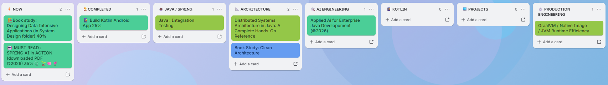

# 🚀 Software Development Roadmap

My continuing professional development roadmap, focused primarily
on Java backend engineering, architecture and modern AI development.

## 🗺️ Roadmap Overview

## ⚡ Now

### Designing Data-Intensive Applications
- Book study
- Progress: 40%

### Spring AI in Action
- Book study
- Progress: 35%

## ☕🍃 Java / Spring

- Java Integration Testing

## 📐 Architecture

- Distributed Systems Architecture in Java
- Clean Architecture

## 🛠 AI Engineering

- Applied AI for Enterprise Java Development (2026)

## 🇰 Kotlin

No current study item.

## 🖥 Projects

No current project.

## ⚙️ Production Engineering

- GraalVM
- Native Image
- JVM Runtime Efficiency

## 🏆 Completed

- Kotlin Android App
